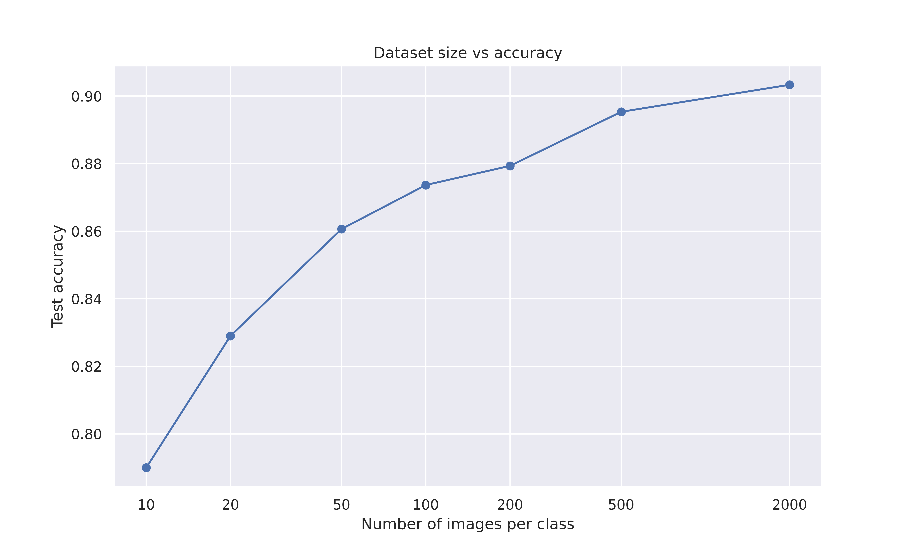

# Intel-image-classification with SimCLR
In this project we experiment with semi-supervised training. The model used in this project is SimCLR, originally proposed by Chen et. al. in the paper titled [A Simple Framework for Contrastive Learning of Visual Representations](https://arxiv.org/abs/2002.05709).

## Dataset
The dataset comes from [Kaggle Intel Image Classification](https://www.kaggle.com/datasets/puneet6060/intel-image-classification). This Data contains around 25k images of size 150x150 distributed under 6 categories.
{'buildings' -> 0, 
'forest' -> 1,
'glacier' -> 2,
'mountain' -> 3,
'sea' -> 4,
'street' -> 5 }

The Train, Test and Prediction data is separated in each zip files. There are around 14k images in Train, 3k in Test and 7k in Prediction.
This data was initially published on https://datahack.analyticsvidhya.com by Intel to host a Image classification Challenge. The Prediction data were used as unlabeled data during training and reported accuracies are on thr Test set. The augmented dataset after contrastive transformations look like this:

## Code
The original SimCLR code is written by Phillip Lippe and can be found in this tutorial [https://uvadlc-notebooks.readthedocs.io/en/latest/tutorial_notebooks/tutorial17/SimCLR.html](https://uvadlc-notebooks.readthedocs.io/en/latest/tutorial_notebooks/tutorial17/SimCLR.html). I modified the dataloader and reshaped the images so that the code can be used with ResNet feature extractor.

## Results
The SimCLR model achieves high acuracy even with small number of data per sample. Below is the summary:

